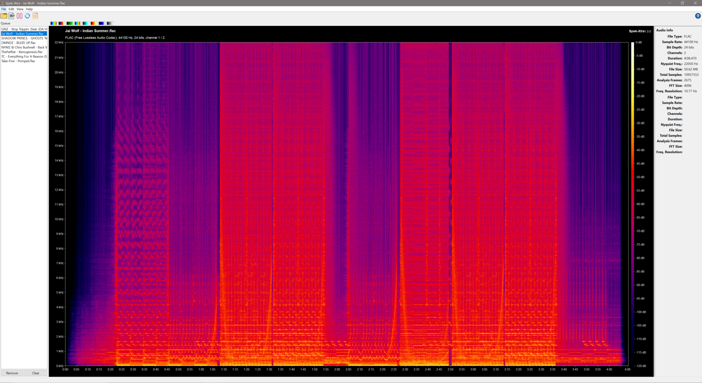
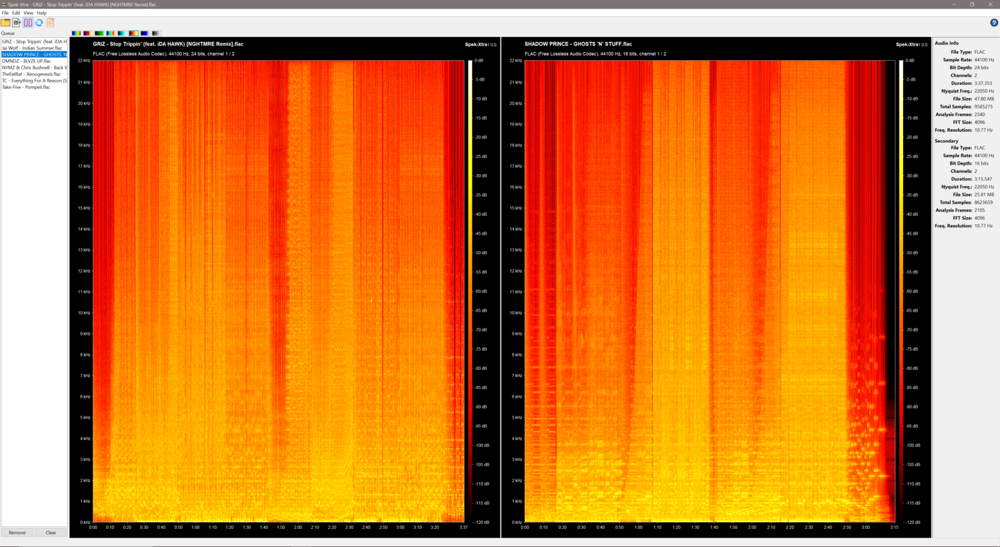
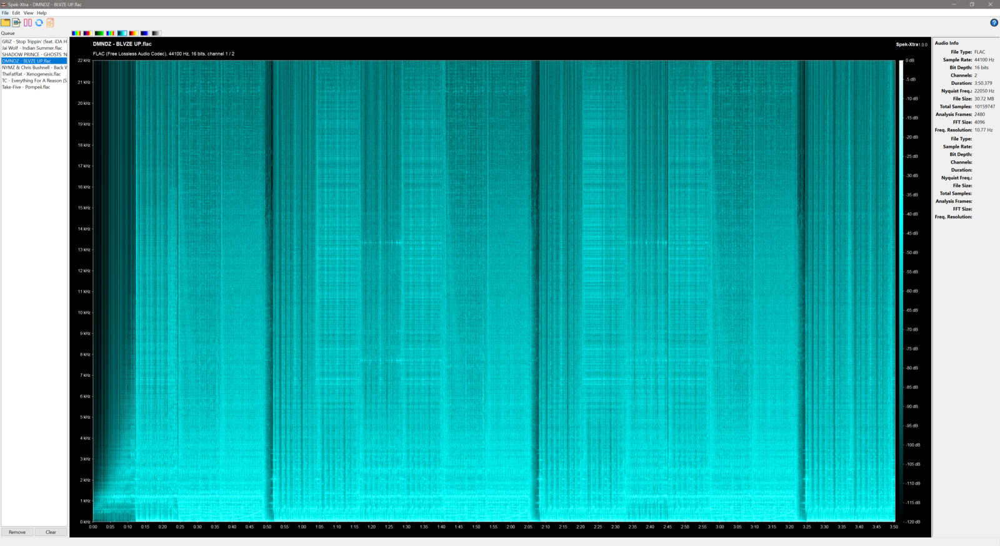

# Spek-Xtra

[](https://github.com/ChefSourOG/spek-Xtra/actions/workflows/ci.yml)
[](https://github.com/ChefSourOG/spek-Xtra/releases/latest)
[](./LICENSE.md)
[](./INSTALL.md)
[](./src)
[](https://github.com/ChefSourOG/spek-Xtra/releases)

[[简体中文 Simplified Chinese]](./README-zh_CN.md)

**Spek-Xtra** (IPA: /ˈspɛks ˈɛkstrə/) is a modern, cross-platform acoustic spectrum analyser for audio files. Originally derived from [Spek](https://github.com/alexkay/spek) and built on top of [Spek-X](https://github.com/MikeWang000000/spek-X/), Spek-Xtra makes it easy to visualise the frequency content of your audio with a clean, responsive, and feature-rich spectrogram.

Whether you are a musician, audio engineer, podcaster, archivist, or hobbyist, Spek-Xtra gives you the tools to inspect codecs, compare takes, export publication-ready spectrograms, and navigate large files with intuitive zoom and pan controls.

---

## Table of Contents

- [Overview](#overview)
- [Features](#features)
- [Screenshots](#screenshots)
- [Download & Installation](#download--installation)
- [Quick Start](#quick-start)
- [History & Lineage](#history--lineage)
- [Building from Source](#building-from-source)
- [Contributing](#contributing)
- [License](#license)
- [Acknowledgements](#acknowledgements)

---

## Overview

Spek-Xtra reads virtually any audio format supported by FFmpeg and renders a detailed, colour-coded spectrogram in real time. It is designed for both quick inspections and deep analysis, offering a streamlined workflow for managing multiple files, comparing tracks side-by-side, and exporting high-resolution imagery for reports or online sharing.

## Features

### Core Analysis
- **Universal format support** — Decodes virtually any audio or video file with an audio track via FFmpeg.
- **High-performance rendering** — Multi-threaded signal processing for ultra-fast spectrogram generation.
- **Interactive status bar** — Real-time readout of frequency (Hz/kHz), time, and decibel level under the cursor.
- **Linear & logarithmic frequency scales** — Toggle between scales to emphasise different spectral regions.

### Visualisation
- **Eight curated colour palettes** — Spectrum, SoX, Green, Rainbow, Teal, Heat, Ice, and Grayscale.
- **Mouse-wheel zoom & click-drag pan** — Inspect transients, harmonics, and noise floors with precision.
- **High-DPI display support** — Crisp rendering on modern 4K and Retina displays.
- **Refreshed iconography** — Updated application logo (with transparent background) and custom toolbar icons.

### Workflow & File Management
- **Audio metadata panel** — Instantly view codec, bit rate, sample rate, channel count, and duration.
- **Sidebar file queue** — Load and manage multiple files without leaving the application.
- **Recent Files** — Quickly reopen any of the last 10 audio files from the File menu.
- **Split-view compare mode** — Load two audio files side-by-side for A/B analysis.

### Export & Sharing
- **Export to PNG** — Save high-resolution spectrogram images with custom dimensions for reports, social media, or archival documentation.

### Platform & Packaging
- **Cross-platform** — Native builds for Windows (x64 & Arm64), macOS (Universal), and Linux (Debian).
- **Single-file Windows executable** — Portable `.exe` with no installation required.
- **Debian package** — Distributed as `spek-xtra` via `.deb`.

### Quality-of-Life Fixes
- Fixed empty spectrogram rendering when the audio info panel is hidden on startup.
- Fixed version-label truncation in the top-right corner of the spectrogram canvas.

---

## Screenshots

| Metadata Panel & Queue | Split-View Comparison | Palette Selection |
|:---:|:---:|:---:|
|  |  |  |

---

## Download & Installation

### Pre-built Binaries

| Platform | Architecture | Package | Notes |
|----------|-------------|---------|-------|
| **Windows** | x64 | [`.zip`](https://github.com/ChefSourOG/spek-Xtra/releases/download/v1.0.0/spek-xtra-1.0.0-windows-x86_64.zip) / [`.exe`](https://github.com/ChefSourOG/spek-Xtra/releases/download/v1.0.0/spek-xtra-1.0.0-windows-x86_64.exe) | Portable or installer |
| **Debian / Ubuntu** | x86_64 | [`.deb`](https://github.com/ChefSourOG/spek-Xtra/releases/download/v1.0.0/spek-xtra_1.0.0_amd64.deb) | Package name: `spek-xtra` |
| **macOS** | Universal (Intel & Apple Silicon) | [`.tgz`](https://github.com/ChefSourOG/spek-Xtra/releases/download/v1.0.0/spek-xtra-1.0.0-macos-universal.tgz) | Extract and run |
| **Source** | Any | [`.tar.gz`](https://github.com/ChefSourOG/spek-Xtra/archive/v1.0.0.tar.gz) | See [Build Instructions](#building-from-source) |

> **Looking for the latest release?** Visit the [Releases page](https://github.com/ChefSourOG/spek-Xtra/releases/latest) for the newest builds, changelogs, and nightly artifacts.

### Installation Notes

- **Windows:** Run the `.exe` installer or extract the `.zip` and run `spek-xtra.exe`. Windows 10/11 x64 or Arm64 recommended.
- **macOS:** Extract the `.tgz` and drag `Spek-Xtra.app` to your Applications folder. macOS 11+ recommended.
- **Linux (Debian/Ubuntu):** Install via `sudo dpkg -i spek-xtra_1.0.0_amd64.deb` or your preferred package manager. FFmpeg and wxWidgets dependencies will be resolved automatically.

---

## Quick Start

1. **Open a file** — Drag and drop an audio file onto the window, use `File → Open`, or select a recent file from the menu.
2. **Inspect metadata** — The left sidebar shows codec, bit rate, sample rate, channels, and duration instantly.
3. **Navigate the spectrogram** — Scroll to zoom in/out on the time axis; click and drag to pan.
4. **Change appearance** — Use the palette dropdown to switch between colour schemes, or toggle linear/logarithmic frequency scaling.
5. **Compare files** — Open a second file to enter split-view mode and compare spectrograms side-by-side.
6. **Export** — Click the export button or use `File → Export to PNG` to save a high-resolution image.

---

## History & Lineage

Spek-Xtra stands on the shoulders of a long lineage of open-source audio tools. Each fork in the chain addressed the evolving needs of the community, from modernising dependencies to adding entirely new workflows.

### 1. Spek (Original) — *Alexander Kojevnikov*
The original [Spek](https://github.com/alexkay/spek) was created by Alexander Kojevnikov as a lightweight, cross-platform acoustic spectrum analyser written in C and C++. It introduced the core concepts that define the ecosystem today:
- Multi-threaded FFT analysis for rapid spectrogram rendering.
- FFmpeg-backed decoding for broad format compatibility.
- Drag-and-drop support and auto-fitting time, frequency, and spectral-density rulers.
- Translations into 19 languages.

Development of the original upstream slowed after 2016, leaving the community to carry the torch.

### 2. Spek-Alternative — *withmorten*
In 2017, [withmorten](https://github.com/withmorten) forked the project as **Spek-Alternative** (v0.8.2.3) to modernise the build system and fix long-standing platform issues. Key contributions included:
- **UI modernisation:** Migrated from GTK+ to wxWidgets for superior Windows and macOS integration, plus better toolbar icons.
- **Packaging:** Delivered a single portable `.exe` for Windows and improved macOS file associations.
- **Format support:** Added `.opus` decoding and 24-bit APE support.
- **Code quality:** Split out `libspek`, added unit tests, and migrated to non-deprecated FFmpeg APIs.
- **Bug fixes:** Resolved crashes on non-writable home directories, fixed Unicode filenames on Windows, corrected spectral-density mapping, and added support for planar sample formats.

### 3. Spek-X — *Mike Wang*
[Mike Wang](https://github.com/MikeWang000000) forked Spek-Alternative into **Spek-X**, pushing the project into the modern era with aggressive dependency updates and new architecture targets. Notable milestones:
- **Codec & dependency updates:** Upgraded to FFmpeg 5.0+, then 6.0, 7.1, and replaced deprecated APIs; updated wxWidgets to 3.0+.
- **New architectures:** Introduced native Apple Silicon and Windows Arm64 binaries, plus macOS Universal builds.
- **Command-line interface:** Added headless support for saving spectrograms directly from the terminal.
- **High-DPI & accessibility:** Fixed clipped text on high-resolution displays and suppressed intrusive wxWidgets warnings.
- **Workflow:** Added audio channel switching, 32-bit FLAC support, and improved Simplified Chinese, Traditional Chinese, and French translations.
- **Stability:** Fixed m4a/ogg decoding errors, plugged memory leaks, and resolved various crash scenarios.

### 4. Spek-Xtra — *ChefSourOG*
**Spek-Xtra** is the latest evolution in this chain. It takes the solid, modern foundation of Spek-X and layers on a suite of professional workflow and visualisation tools:
- **Information-rich UI:** A dedicated metadata panel and interactive status bar for precise cursor readouts.
- **Colour & export:** Eight palettes and high-resolution PNG export for professional documentation.
- **File management:** A sidebar queue, Recent Files list, and split-view comparison mode for A/B analysis.
- **Navigation:** Mouse-wheel zoom and click-drag panning for detailed spectral inspection.
- **Polish:** Refreshed branding, high-DPI iconography, and targeted bug fixes for a seamless first-run experience.

---

## Building from Source

Spek-Xtra requires a C++11-capable compiler and the following dependencies:

- **wxWidgets** >= 3.0
- **FFmpeg** >= 5.0

Platform-specific build instructions are maintained in the following guides:

| Platform | Guide |
|----------|-------|
| Windows | [`dist/win/README.md`](./dist/win/README.md) |
| macOS | [`dist/osx/README.md`](./dist/osx/README.md) |
| Linux & Unix-like | [`INSTALL.md`](./INSTALL.md#building-from-the-git-repository) |

### Quick Build (Linux/macOS)

Install the build dependencies first. On Debian/Ubuntu:

```bash
sudo apt install -y g++ make pkg-config autoconf automake libtool \
    intltool gettext autopoint libwxgtk3.2-dev wx-common \
    libavcodec-dev libavformat-dev
```

Then build:

```bash
git clone https://github.com/ChefSourOG/spek-Xtra.git
cd spek-Xtra
./autogen.sh          # or ./configure if present
make
sudo make install     # optional
```

---

## Contributing

Contributions, bug reports, and feature requests are welcome.

1. **Issues** — Open a [GitHub Issue](https://github.com/ChefSourOG/spek-Xtra/issues) to report bugs or request features.
2. **Pull Requests** — Fork the repository, create a feature branch, and submit a PR against `main`. Please ensure your changes pass CI and adhere to the existing code style.
3. **Translations** — If you would like to improve or add a new translation, please open an issue first to coordinate.

---

## License

Spek-Xtra is released under the same open-source license as its predecessors. See [`LICENSE.md`](./LICENSE.md) for the full text.

---

## Acknowledgements

- **Alexander Kojevnikov** for creating the original [Spek](https://github.com/alexkay/spek).
- **withmorten** for maintaining [Spek-Alternative](https://github.com/withmorten/spek-alternative) and keeping the project alive through the upstream hiatus.
- **Mike Wang** for [Spek-X](https://github.com/MikeWang000000/spek-X/), modernising dependencies, adding CLI support, and expanding platform coverage.
- The **FFmpeg** and **wxWidgets** teams for the foundational libraries that make Spek-Xtra possible.
